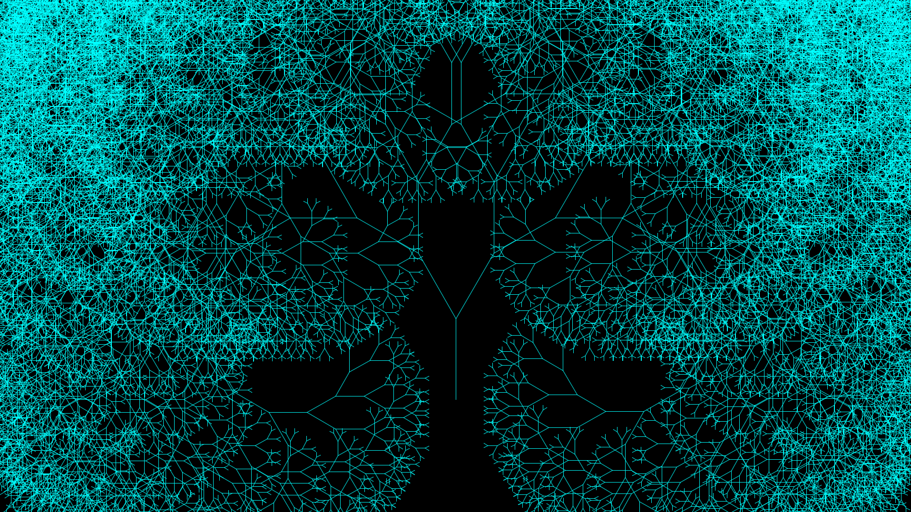

# Java Fractal Trees

    
    

A simple program that allows the user to draw beautiful fractal trees.

# Contribution

If you'd like to contribute to `java_fractal_trees` please submit a pull-request on a
feature branch.

# Installing

Clone the repo:

    git clone http://github.com/Sommos/java_fractal_trees
    cd java_fractal_trees
